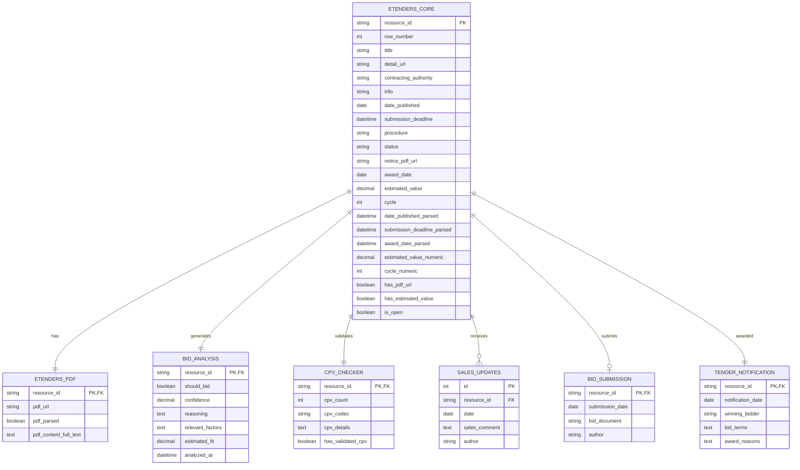

# Data Product Development <!-- 1000 words -->

<!-- Understand the specific business problem to be addressed -->

We want to build a data product that becomes an invaluable bid preparation, analysis and feedback tool. Something that allows non-technical users to ask questions about the tenders coming out of the Irish Govt, identify tenders that we maybe should of bid for that didn't and ultimately provides a sales feedback loop that drives further commercial successes.

## Data Pipeline & Data Sources

There are 7 data sources when it comes to updating the database, turning it into the commercial backbone of the Sales Process.

The pipeline contains the traditional Extract, Transform & Load stages BUT in fact it's more in-depth, thanks to the introduction of AI.

1. ETL
   - Scrape (extract)
   - Parse (transform)
   - Load

2. AI Enrichment
   - PDF Parsing with Ollama

3. AI Analysis
   - Bid recommendation with Ollama

4. Business Updates
   - Bid Submission
   - Sales Updates
   - Awards

Although a "load" step exists in the first "ETL" stage we're in fact writing the data to the database (or files) as each step completes.

## DB Schema & ERD

Figure 7: DB Schema and ERD

The diagram shows:

- **1:1 relationships** between `ETENDERS_CORE` and `ETENDERS_PDF`, `BID_ANALYSIS`, `CPV_CHECKER`, and `TENDER_NOTIFICATION`
- **1:Many** relationship with `SALES_UPDATES` (multiple progress updates per tender)
- **1:0 or 1** relationship with `BID_SUBMISSION` (optional, but max one per tender)

All tables use `resource_id` as the linking key, with `SALES_UPDATES` having its own auto-increment ID as the primary key.

## Data Product

### Scalability & Performance

The pipeline adds up to 50 records (maximum) per day and Sales Team members add updates but this isn't anything near enough to stretch PostgreSQL on either scalability or performance.

We've indexed common query patterns (date ranges, status, value), which keeps performance well within acceptable limits. Additional optimization becomes relevant only at 100,000+ records or with real-time requirements - neither applies to our use case.

We are going nowhere _near_ postgresql's limits (www.postgresql.org, n.d)

### Security

**Who has access?**
Role-Based Access Control (RBAC) splits access into groups and ensure "least privilege" (Microsoft RBAC, 2024)

For example we'd give Sales "read" access to everything but only "write" access to bid submissions fields and Management would get "read all" and so on.

Only authorized individuals have access using Azure AD integration with Single Sign-On (SSO) and mandatory Multi-Factor authentication (najshahid, 2025). Access should be auditable in the logs alongside other database activity.

**Data Protection**
All data should be encrypted at rest and in transit using TLS 1.3 or higher with API keys and secrets held in secure storage like Azure Key Vault with automated key rotation built in.  (msmbaldwin, n.d.)

**Application Security**
Input validation prevents things like SQL injection attacks and XSS (cross site scripting) while rate limiting on any API's prevent miss-use.

**Network Security**
The database should NOT be publically available on the web. If we _do_ happen to need this we should at least enable DDOS protection on any public IP/ports. Use Network Security Groups with a port/source whitelist and also put everything behind a NAT Gateway (asudbring, 2023)

**Compliance & Governance**
Enlist a third party carries out an annual independent security audit and there should be an incident response plan for responding to a possibl data breach.

The data can also be considered as 'internal only' and 'confidential' so this should inform our security architecture.

### Regulatory Compliance

**GDPR:**
Only the necessary minimum data should be collected and certainly not anything that could be considered personally identifiable information (Wikipedia Contributors, 2019)
We can use AI related services from cloud providers to purge public identifiable information (PII) and have the ability to remove any on request. (laujan, 2025)

**Data Retention and Auditing:**
Monthly point in time recovery with a years backups in archive (to reduce cost).

Activity logging allows auditing of data access requests, logins and even performance behaviour.

**Industry Standards:**
We need to document security controls like ISO 27001 (International Organization for Standardization, 2022) and any cloud compliance certificates i.e. ISO 27018 which is cloud specific (for, 2025)

### Flexibility for future Use

**MCP Server Integration:**
Model Context Protocol implementation empowers end-users to ask natural language questions of the data, for example: - "Show me all the healthcare tenders over €1m in value in the last 12 months".

This also enables other AI Assistants to return structured responses when they decide to get this data to answer a related question.

**Predictive Analytics and AI:**
Once enough tender and response data exist this can be used in the ML training to return an overall probability of a successful bid based on historical patterns.

Another application might be taking the previously submitted winning bids and having AI produce an auto-generated first draft for new responses that takes context from historical successes.

**Technology Agnostic Design:**
A more generic architectural approach like containerisation (Powell, 2021) might be useful for it's ability to be deployed on any cloud, or on-prem.

This means we won't get painted into a corner when going from building the solution (the Dev part) to deploying and running it i.e. the "Ops" part.

### Best practices

There are a LOT of sources and influences on best practices when it comes to database design, deployment, software engineering and AI/ML.

**Data Engineering:**
If we're going to host this solution in the cloud (again) we can look at the Microsoft or AWS well architected framework guides (PageWriter-MSFT, 2023) which inform security, reliability, operational scalability and cost-optimisation at the 'cloud' level.

These also link to DevOps practices like deploying everything using infrastructure as code tools (bicep, terraform, pulumi), using version control for scripts, automated testing and CI/CD pipelines.

**Software Development:**
This covers basic things like clean code principles (Codacy, 2023), having meaningful code reviews, deployment gates and adhering to the twelve factor app methodology as much as possible (Wigging, 2017).

**AI/ML best practices:**
We must follow responsible AI principals (mesameki, 2024) with a human in the loop to check any decision making and ensure accountability.

<!--
**References:**
- Azure Architecture Center: Reference architectures for data analytics solutions
- Google SRE Book: Site Reliability Engineering principles
- DAMA-DMBOK: Data Management Body of Knowledge for data governance
- OWASP: Web application security standards and testing guidelines
-->

<!--
● Understand the specific business problems to be addressed and identify all necessary data sources.
● Plan and define the data solution, including any ETL processes or data flows. Consider data formats, sizes, and frequency of updates in the design.
● Choose an appropriate data solution (see list below), focusing on compatibility and scalability. This may be a low-code, no-code, or a coded solution, depending on business needs.
● Develop your data product, conduct comprehensive testing, and automate with scheduling.
● Focus on scalability, performance optimization, security, and regulatory compliance.
● Ensure flexibility for future changes and adherence to best practices.
-->

<!-- Milestone 2
## Design and develop a scalable, secure ETL pipeline proof of concept that adheres to industry best practices.
  - Stakeholder Identification and Needs Analysis
  - Identify key stakeholders involved in the data engineering process and detail their roles.
  - Conduct a needs analysis based on stakeholder feedback, categorizing primary requirements and challenges.
  - Prioritize these needs in alignment with business goals and outline high-level requirements for a data solution.
## ETL Process Requirements and Solution Selection
  - Specify the ETL process requirements, focusing on data types, flow frequency, volume, and data quality standards.
  - Compare and evaluate at least two ETL tools or frameworks (e.g., Apache Airflow vs. AWS Glue) for their alignment with organizational requirements.
  - Justify the selection based on criteria like performance, scalability, security, and regulatory compliance.
-->
