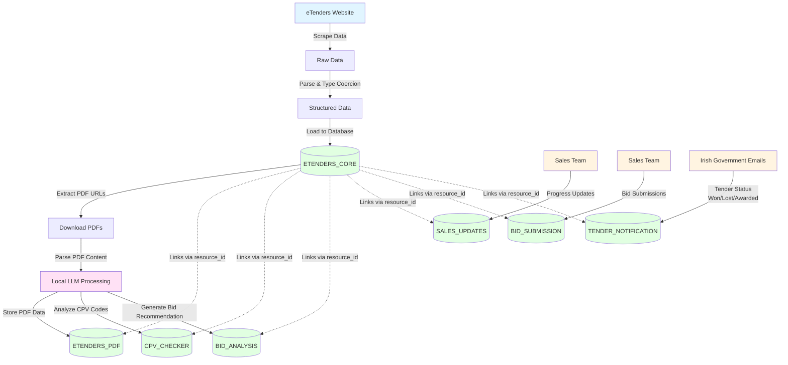

# Proof of Concept <!-- 500 -->

The revised architecture can be roughed out in a simple proof of concept using Python to capture the eTenders data from the site, parsing the PDF content and have AI split the content of the PDF into additional fields within the pdf_content table.

Before the advent of AI we'd have used Regex for this last step but now that LLM's can output structured data reliably using a locally hosted LLM (possibly running in a container) this is basically free and easy to implement.

Following software development best practice around separation of concerns we can have Python fuctions that carry out discrete steps: -

1. Scrape the data
2. Parse it into the correct type
3. Retreive the PDF content
4. Parse the PDF content using a local LLM
5. Analyse the number of CPVs in the tender
6. Have a local LLM analyse the tender
7. Output the content, store or send it 'somewhere' - options are csv, json or postgres

If we don't know "where" to send the data at this point we could have multiple functions to do step 7 and just vary the "write" parts at the end.



Figure 8: Data Pipeline Flow Diagram

The technical aspect of implementing these steps is NOT complicated and doesn't require the use of third party tools. In fact, using Python allows us to really tune the solution to our needs.

## Testing

Another advantage of writing the data pipeline ourselves is that we can create tests to comprehensively handle each step in the process.


Figure 9: Test Results

This encompasses the following: -

- Data structure checks
- Type coercion for dates & currencies
- PDF downloads & validation
- Getting the CPV codes
- Validating the DB schema
- Data integrity and business rules

Being able to check & run these tests on a consistent basis could easily be added to any deployment pipeline too.

The most important (initial) tests make sure that the eTenders data format that's being scraped hasn't been changed by the source. The Irish Govt in this case.

## Logging & Debugging

We can make sure that each step has proper logging which can be turned on as needed via the `--enable-logging` flag.

The entire data pipeline logs outputs to a file, in this case see  where we can see issues arrise and take measures to fix the pipeline directly.

Building our own data pipeline in code means we can respond flexibly and quickly to issues that arrise.

### PDF Extraction Errors

About 30% of errors (not records!) are PDF extraction errors.

```log
2025-11-28 14:39:26,109 - pdf_parser - ERROR - Error extracting text from PDF https://www.etenders.gov.ie/epps/cft/downloadNoticeForAdvSearch.do?resourceId=6965752: No /Root object! - Is this really a PDF?
Traceback (most recent call last):
  File "/Users/robert.sweetman/Documents/GitHub/module_4/python/pdf_parser.py", line 54, in extract_pdf_text
    text = extract_text(pdf_file)
  File "/Users/robert.sweetman/Documents/GitHub/module_4/python/venv/lib/python3.9/site-packages/pdfminer/high_level.py", line 177, in extract_text
    for page in PDFPage.get_pages(
  File "/Users/robert.sweetman/Documents/GitHub/module_4/python/venv/lib/python3.9/site-packages/pdfminer/pdfpage.py", line 159, in get_pages
    doc = PDFDocument(parser, password=password, caching=caching)
  File "/Users/robert.sweetman/Documents/GitHub/module_4/python/venv/lib/python3.9/site-packages/pdfminer/pdfdocument.py", line 752, in __init__
    raise PDFSyntaxError("No /Root object! - Is this really a PDF?")
pdfminer.pdfparser.PDFSyntaxError: No /Root object! - Is this really a PDF?
```

Figure 10: PDF Extraction Errors

Some URLs that are in the eTenders data are possibly HTML pages or corrupted. Now that's clear we can add defensive code fixes to the pipeline and improve the logging further.

```python
def download_and_validate_pdf(url):
    try:
        response = requests.get(url, timeout=30)
        
        # Check Content-Type header first
        content_type = response.headers.get('Content-Type', '')
        if 'application/pdf' not in content_type:
            log_error(f"Not a PDF (Content-Type: {content_type})")
            return None
            
        # Validate PDF magic bytes
        if not response.content.startswith(b'%PDF'):
            log_error(f"Invalid PDF format")
            return None
            
        return response.content
    except Exception as e:
        log_error(f"Download failed: {e}")
        return None
```

Figure 11: Python fix for PDF Extraction Errors

### Server Errors

About 35% of errors involve the server not responding to certain requests.

```log
2025-11-28 14:17:29,640 - pdf_parser - ERROR - Failed to download PDF from https://www.etenders.gov.ie/epps/cft/downloadNoticeForAdvSearch.do?resourceId=7012322: 500 Server Error: Internal Server Error for url: https://www.etenders.gov.ie/epps/cft/downloadNoticeForAdvSearch.do?resourceId=7012322
```

Figure 12: Server Errors

We can add some retry logic to the pipeline to fix this.

```python
from tenacity import retry, stop_after_attempt, wait_exponential

@retry(
    stop=stop_after_attempt(3),
    wait=wait_exponential(multiplier=1, min=4, max=60)
)
def download_with_retry(url):
    response = requests.get(url, timeout=30)
    response.raise_for_status()
    return response.content
```

Figure 13: Python Fix for Server Errors

### LLM JSON parsing errors

The LLM can produce invalid or incomplete JSON

```log
2025-11-28 14:27:26,769 - pdf_parser - ERROR - JSON Parse Error at line 1, column 202: Expecting ',' delimiter
```

Figure 14: JSON Parsing Errors

Again we can add some defensive python coding (REF: defensive coding) to address this by attempting to repair anything that contains this error

```python
def parse_with_llm_robust(text):
    prompt = """Extract structured data as valid JSON. 
    IMPORTANT: Output ONLY complete, valid JSON with all closing braces.
    
    Required fields:
    - procedure_id (string)
    - title (string)
    - buyer_name (string)
    - buyer_country (string)
    - estimated_value (number)
    
    Text to parse:
    {text}
    """
    
    try:
        response = ollama.generate(
            model='llama2',
            prompt=prompt.format(text=text[:4000]),  # Limit input
            format='json'  # Force JSON output
        )
        
        # Validate JSON before returning
        parsed = json.loads(response['response'])
        return parsed
        
    except json.JSONDecodeError as e:
        # Try to salvage partial JSON
        log_error(f"JSON parse error: {e}")
        return attempt_json_repair(response['response'])
```

Figure 15: Python fix for JSON Parsing

### Timeout Errors

We can see about 10% of errors are due to timeouts getting larger PDF's

```log
2025-11-28 14:11:49,230 - pdf_parser - ERROR - Error parsing with Ollama: HTTPConnectionPool(host='localhost', port=11434): Read timed out. (read timeout=90)
Traceback (most recent call last):
  File "/Users/robert.sweetman/Documents/GitHub/module_4/python/venv/lib/python3.9/site-packages/urllib3/connectionpool.py", line 468, in _make_request
    six.raise_from(e, None)
  File "<string>", line 3, in raise_from
  File "/Users/robert.sweetman/Documents/GitHub/module_4/python/venv/lib/python3.9/site-packages/urllib3/connectionpool.py", line 463, in _make_request
    httplib_response = conn.getresponse()
  File "/Library/Developer/CommandLineTools/Library/Frameworks/Python3.framework/Versions/3.9/lib/python3.9/http/client.py", line 1349, in getresponse
    response.begin()
  File "/Library/Developer/CommandLineTools/Library/Frameworks/Python3.framework/Versions/3.9/lib/python3.9/http/client.py", line 316, in begin
    version, status, reason = self._read_status()
  File "/Library/Developer/CommandLineTools/Library/Frameworks/Python3.framework/Versions/3.9/lib/python3.9/http/client.py", line 277, in _read_status
    line = str(self.fp.readline(_MAXLINE + 1), "iso-8859-1")
  File "/Library/Developer/CommandLineTools/Library/Frameworks/Python3.framework/Versions/3.9/lib/python3.9/socket.py", line 704, in readinto
    return self._sock.recv_into(b)
socket.timeout: timed out
```

Figure 16: Timeout Errors

So we can add a retry queue to address these problems.

```python
class ErrorHandler:
    RETRYABLE = ['500', 'timeout', 'connection']
    SKIP = ['No /Root object', 'JSON Parse Error']
    
    def handle_error(self, error, url):
        if any(e in str(error) for e in self.RETRYABLE):
            # Add to retry queue with backoff
            self.retry_queue.add(url, delay=calculate_backoff())
        else:
            # Log and skip
            self.failed_urls.add(url)
            log_to_csv(url, error, 'SKIPPED')
```

Figure 17: Python fix for Timeout Errors

<!--
Design, implement and debug a data product

RUBRIC - B

Develop a comprehensive data product meeting business requirements, with focus on scalability, performance, security and compliance. Conducts thorough testing and logging

RUBRIC - A

Develops a hightly adaptable, scalable data product exceeding current business needs. Implements a solution with optimized performance and proactive security measures. Provides actionable insights driving business value. Evaluates the use of automation and scheduling
-->
