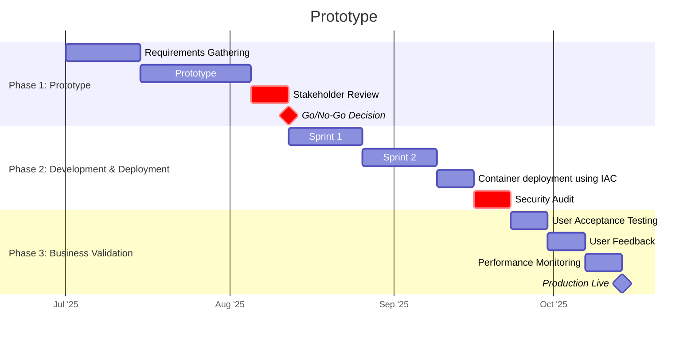

# Impact Assessment and Recommendations for Rollout <!-- 800 words -->

Let's not forget that SALES generate REVENUE so ultimately our goal and the measure of our success is that we've contributed in a meaningful way to increased billing.

This approach delivers a secure, monitorable and maintainable data product while leaving room for additional features and valuable integrations to other data sources.

## Business Wins

In addition to the reduction in Sales admin the business can display key business intelligence information from the data.

Figure 18: eTenders Intelligence Dashboard

Shows the number of bids AI has recommended should be responded to, the total value of these bids (€72 million) while making it clear that 85% of tenders that are published aren't worth responding to!

Figure 19: eTenders Top Opportunities by Value

Shows the top opportunities by value as well as the overall distribution of AI recommended bids by value. Perhaps un-surprisingly IT consultancy related tenders tend to cluster > €500K range.

Given this visualization business stakeholders should be able to get an 'at a glance' appreciation for the value of pulling this data into a queriable database.

Having Sales Team members append update records to tenders in progress would allow them to monitor additional sales related KPI's and drive sales improvements:

- When was the last time a bid was updated?
- How often are customers contacted?
- Percentage of won/lost bids?
- How long does it take to respond to a tender?
- How many points of contact happen before a bid is won?

All of these metrics get added to the tender records as they progress to help answer the question "What does our process of winning a tender look like?"

As we see from the data, the cost of missing a bid or losing an opportunity is already very high. We can quible over implementation costs but if this effort tips the chance of winning even a portion of the €70 million then it's worth doing.

## Implementation and Rollout Plan

In order to de-risk the development and deployment of the solution we can take a phased approach

<!-- markdownlint-disable MD033 -->

<!-- markdownlint-enable MD033 -->

Figure 20: Phased Delivery Plan

### Phase 1: Prototype (6w)

The goal is to validate the technical feasibility as well as ensure all stakeholder feedback has been considered. We can use the following KPI's to ensure all the requirements have been met:

- Majority (>80%?) of stakeholders approve moving forwards
- Technically feasible in that eTenders can be obtained, stored and processed
- Prototype can be created with a set of minimum features (MVP)

#### Phase 1: Contingency

If the PoC proves challenging then pivot to using a different datasource, running everything manually for a while or deploying as something other than a container. Azure Functions might be an alternative.

### Phase 2: Development and Deployment (6w)

Phase 2 goal is to develop and deploy the solution securely in the cloud paying attention to the following measures to validate success:

- Test coverage that ensures code quality
- Successful deployment to the Azure cloud environment
- Resources deployed pass Microsoft's cloud security checks

#### Phase 2: Contingency

Deployment might be delayed to allow security issues to be patched or possibly the run-rate budget might need to increase to include higher cost protections like Nat Gateways and Azure AD for access.

### Phase 3: Business Validation (3w)

The goal here is to be able to demonstrate business value and validate user adoption in the short term. Longer term measures will only come to light after several bid cycles have been completed.

#### Short term business measures

- High (>80%) uptake of using the tool by the Sales Team
- Reduction in reported sales admin (time) by Sales Team
- User satisfaction survey reports improvement (anonymous Sales Team survey)

#### Long term business measures

- Overall increase in bids won (revenue) over a 6 - 12 month period
- Identify more opportunities to bid on
- Additional features and integrations are requested by the Sales Team as this proves the product is becoming more useful to the business overall
- Additional requests for analytics and dashboards from Sales Management which again shows interest and buy-in

#### Phase 3 Contingency

If users struggle then additional training would have to be considered and for some users to be selected to champion the use of this tool as a replacement for out-dated manual processes. As with all implementations buy in and support from Management is essential for success.

## Summary

The dashboard clearly shows the value of having a well architected data product that surfaces business value and can drive commercial success.

Taking a phased approach to delivery keeps all contributors on track and leaves scope for further improvements later.

<!--
● Set measurable goals for your data product, aiming for improvements in data processing speed, accuracy, and resource efficiency.
● Monitor improvements in processing time, data quality, resource utilisation, scalability, and error rates.
● Assess impacts on user productivity, business decision-making, cost savings, and revenue. Collect user feedback to gauge satisfaction and ease of use.
● Compile findings into a comprehensive report with visualisations for clarity.
-->

<!--

Develops a value analysis showing the potential impact of a data-driven solution and distinctly justify your approach to stakeholders (K14)

RUBRIC - B

Develops a value analysis that quantifies the potential impact of a data-driven solution across multiple business metrics. Includes thorough analysis of stakeholder needs from key departments. Provides a clear implementation plan with defined milestones.

RUBRIC - A

Develops a multi-faceted value analysis that quantifies short-term and long term impacts of a data-driven solution, including ROI projections. Incorporating analysis of stakeholder needs across all levels of the organisation. Provides a detailed implementation plan with phased rollout strategy, specific KPI's for each phase and contingency plans.

-->
